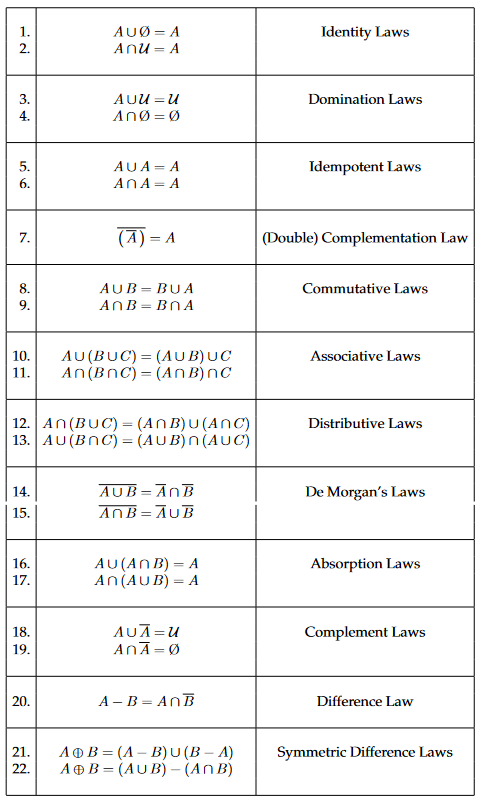
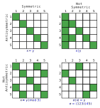
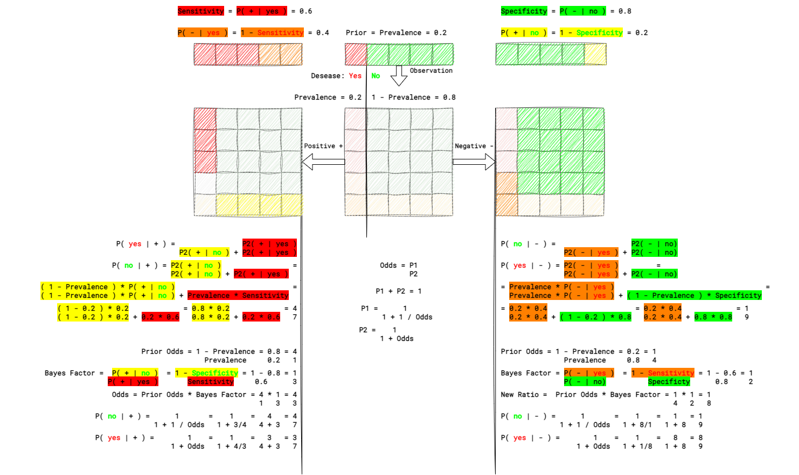
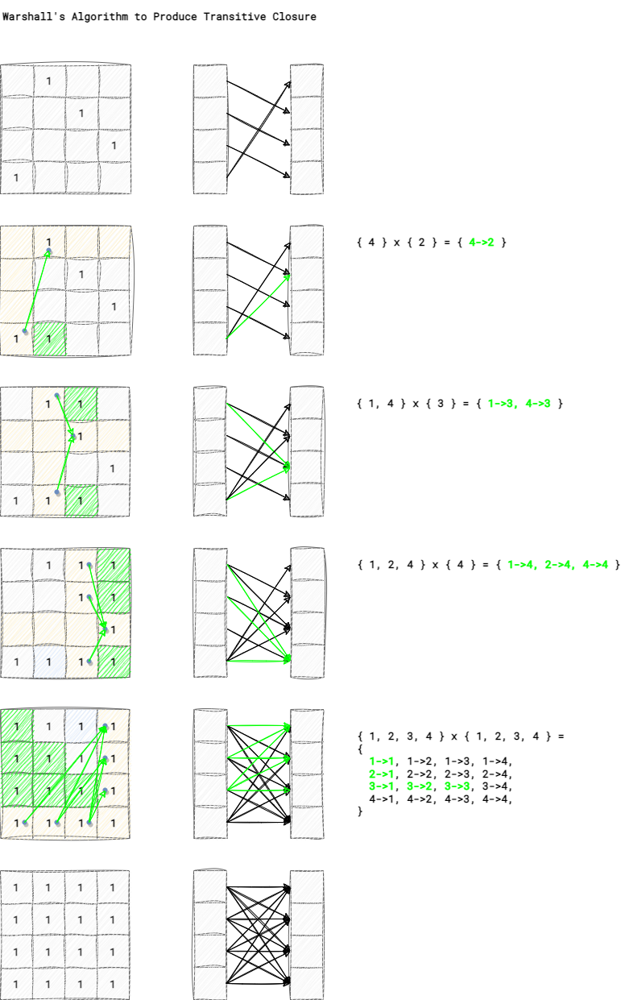
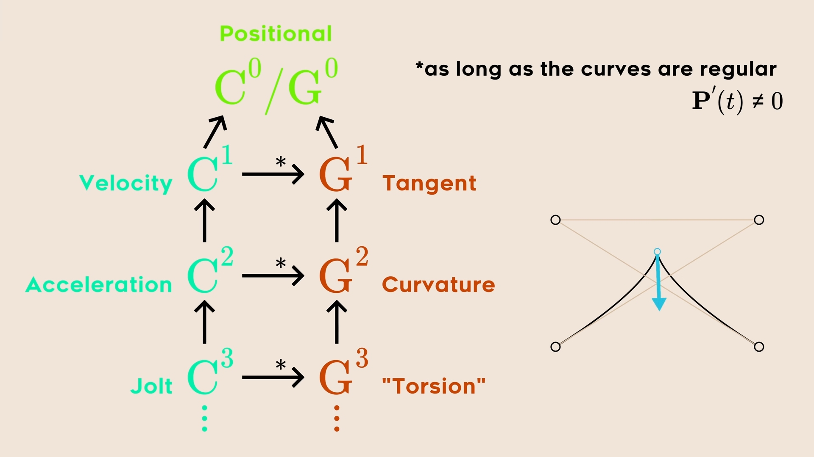

# Cheatsheets of Discrete Math.

<!-- [:arrow_down: Tags legend](#tags-legend) at the end of the page. -->

<!-- -  by  ( _:movie_camera:_ ) -->

## Set Identities

## Relation's Symmetry vs Antisymmetry

## Bayes in Odds

## Warshall's Algorithm

## Curve Continuity

